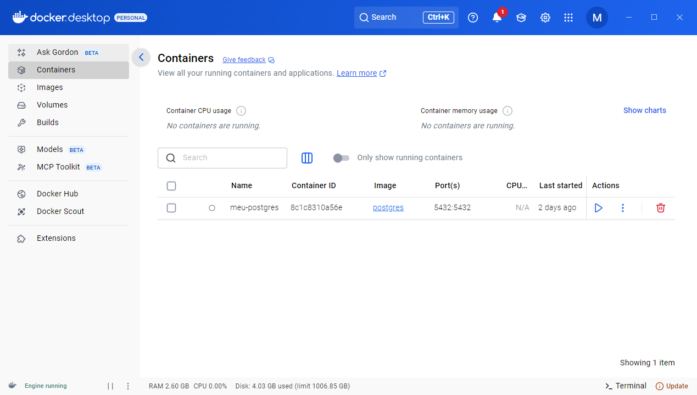
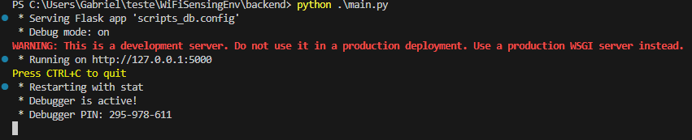
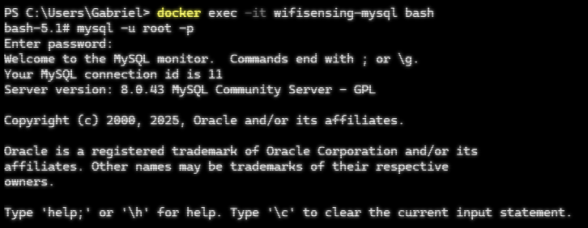
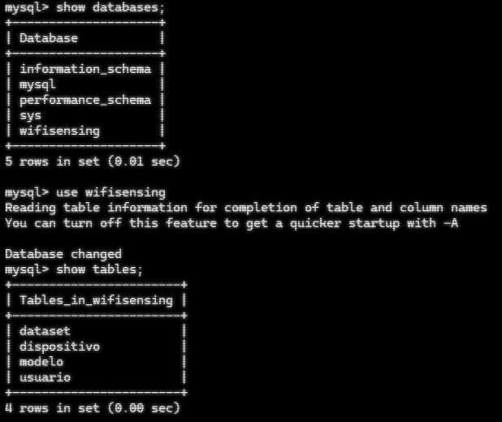
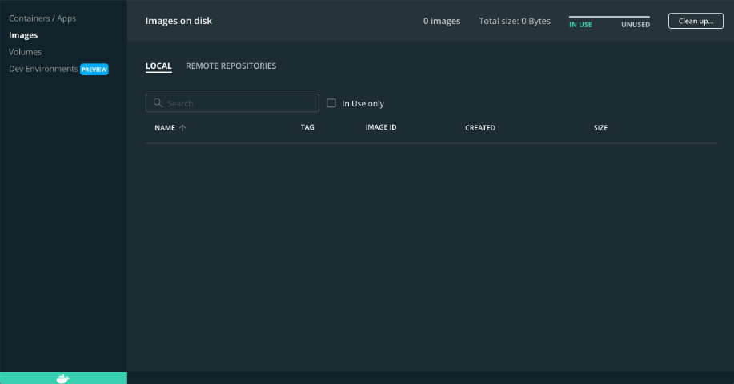

# SensingFI
Plataforma SensingFI

## Pré-requisitos para conseguir rodar o Framework

- Ter o python 3.0.0 pra cima instalado em seu computador
- Ter a biblioteca Flask do python instalada
- Ter o docker para poder rodar o banco de dados localmente

- [Estou usando Windows](#Windows)
- [Estou usando Linux](#Linux)
- [Estou usando macOS](#macOS)


## Passos de instalação
### Linux 
Rode o programa abaixo pra conseguir instalar o python (siga a ordem colocada para evitar erros)
```
sudo apt update
sudo apt install python3 python3-pip
pip3 install Flask Flask-SQLAlchemy Flask-Cors pymysql
```

Agora com o python instalado, [esse](https://docs.docker.com/desktop/setup/install/linux/#where-to-go-next) é o site para você conseguir baixar o docker desktop na sua distro  

É com ele que vamos rodar nosso mysql para o framework, deixe seu docker desktop aberto e sempre veja se a engine dele está rodando, para isso, é só deixar ele aberto e ver se não aconteceu nenhum tipo de erro como "engine stoped".  

O docker vai estar parecido com isso:  

  

Perceba que na parte de baixo, na esquerda está escrito "Engine running", se estiver desse jeito no seu, o docker está rodando.   

Com ele instalado e aberto/rodando, abra um terminal externo e rode o comando:  
```
docker run --name wifisensing-mysql \
  -e MYSQL_ROOT_PASSWORD=root \
  -e MYSQL_DATABASE=wifisensing \
  -p 3306:3306 \
  -d mysql:8.0 \
  --default-authentication-plugin=mysql_native_password
```

Após executar ele, abra o seu docker novamente, nele aparecerá isso:  

  

Seu banco de dados está rodando :D

---  

Com o seu banco de dados rodando, vá para a pasta "backend", abra um terminal novo e rode `python3 main.py` ou `python3 .\main.py` (python3 porque as vezes só python aponta para python2, você também pode rodar apenas python se estiver apenas o python 3.x.x instalado, como é o meu caso)  

deverá aparecer assim para você no seu terminal:  

  

Para conseguir ver as tabelas criadas e acessar o que foi salvo, abra um terminal por fora e rode `docker exec -it wifisensing-mysql bash`  
Rode `mysql -u root -p` e se pedir uma senha ela é "root" (é o seu banco de dados no seu computador), aparecerá algo assim no seu terminal  

  

Isso mostra que você entrou no mysql, agora rode os comandos: `show databases;`, `use wifisensing;` e `show tables;`, aparecerá assim para você

  

E parabéns, seu backend está rodando :D

---
### macOS
Com o Mac, usaremos o comando do Homebrew, segue o código de instalação dele
```
/bin/bash -c "$(curl -fsSL https://raw.githubusercontent.com/Homebrew/install/HEAD/install.sh)"
```

Com o comando funcionando, vamos instalar o python e as dependencias necessárias
```
brew update
brew install python
pip3 install Flask Flask-SQLAlchemy Flask-Cors pymysql
```

Temos o python, precisamos agora de um local para rodar nosso mysql, usaremos o docker desktop, [esse](https://www.youtube.com/watch?v=18_1yMvZlqY) é o vídeo para instalação dele no mac, ele tem instalador então fica mais fácil.  

Com ele baixado, abra ele, a tela será parecida com essa  

  

Note na parte debaixo na esquerda, a logo do docker deve estar verde, com isso seu docker está rodando perfeitamente.  

Agora que temos o docker, abra um terminal externo e rode esse comando  
```
docker run --name wifisensing-mysql \
  -e MYSQL_ROOT_PASSWORD=root \
  -e MYSQL_DATABASE=wifisensing \
  -p 3306:3306 \
  -d mysql:8.0 \
  --default-authentication-plugin=mysql_native_password
```

Depois de tudo rodar, volte para o docker desktop, deverá aparecer isso para você nele  

  
Caso aquele quadrado esteja com um triângulo, aperte nele para que o mysql rode  

Nosso mysql está rodando no docker  

Agora, vá para a pasta "backend" no terminal e rode `python3 main.py` ou `python3 .\main.py` (python3 porque as vezes só python aponta para python2, você também pode rodar apenas python se estiver apenas o python 3.x.x instalado, como é o meu caso)  

O terminal deverá mostrar isso  

  

Agora nosso backend está rodando, para ver as tabelas, usaremos o terminal por enquanto.  
Abra um terminal e rode isso  
```
docker exec -it wifisensing-mysql bash
mysql -u root -p
```
Caso ele peça uma senha, a senha é "root" pois ele roda no seu computador, o terminal deve mostrar isso  

  

Isso mostra que você entrou no mysql, agora rode os comandos: `show databases;`, `use wifisensing;` e `show tables;`, aparecerá assim para você

  

E parabéns, seu backend está rodando :D

---
### Windows

Será necessário baixar o python, use o [site oficial](https://www.python.org/downloads/) e baixe, aparecerá um botão amarelo falando baixar o python mais recente, após baixar, ao abrir a janela do programa, marque as caixas que falam sobre usar privilégios de administrador e de adicionar ao PATH do sistema e espere baixar, e estará tudo pronto  

Pra garantir que o python está no PATH do sistema execute:
```
python --version
pip --version
```
Se aparecer as versões válidas deles, tá tudo certo, se não:

- Pressione Win + R, digite sysdm.cpl e pressione Enter.
- Clique em Avançado > Variáveis de Ambiente.
- Na seção Variáveis do sistema, encontre e selecione Path, depois clique em Editar.
- Clique em Novo e adicione o caminho para a pasta Scripts do Python, um exemplo: (o python39 é a versão 3.9 do python, troque pela versão que foi instalada, se foi 3.11 será 311 e assim por diante)
```
C:\Python39\Scripts\
C:\Python39\
```
- Clique em OK em todas as janelas para salvar as alterações.
- Reinicie o PowerShell e verifique novamente com
```
python --version
pip --version
```  

Com o python instalado, rode o comando `pip3 install Flask Flask-SQLAlchemy Flask-Cors pymysql` para baixar as dependências necessárias para rodar o framework.  

Com o python devidamente configurado, precisaremos de um lugar para podermos rodar nosso mysql, [baixe](https://docs.docker.com/desktop/setup/install/windows-install) o docker para o seu windows com o instalador dele.  

Ao abrir ele, seu docker estará parecido com esse  

  

Note na parte debaixo na esquerda, o seu docker deve estar mostrando "Engine running", ele vai demorar um pouco para carregar mas ele deve aparecer esse "Engine running", com isso seu docker estará rodando  

Abra um terminal com o docker ainda ligado e rode  

```docker run --name wifisensing-mysql -e MYSQL_ROOT_PASSWORD=root -e MYSQL_DATABASE=wifisensing -p 3306:3306 -d mysql:8.0 --default-authentication-plugin=mysql_native_password```  

Depois de tudo rodar, volte para o docker desktop, deverá aparecer isso para você nele  

  

Nosso mysql está rodando no docker  

Agora, vá para a pasta "backend" no terminal e rode `python3 main.py` ou `python3 .\main.py` (python3 porque as vezes só python aponta para python2, você também pode rodar apenas python se estiver apenas o python 3.x.x instalado, como é o meu caso)  

O terminal deverá mostrar isso  

  

Agora nosso backend está rodando, para ver as tabelas, usaremos o terminal por enquanto.  
Abra um terminal e rode isso  
```
docker exec -it wifisensing-mysql bash
mysql -u root -p
```
Caso ele peça uma senha, a senha é "root" pois ele roda no seu computador, o terminal deve mostrar isso  

  

Isso mostra que você entrou no mysql, agora rode os comandos: `show databases;`, `use wifisensing;` e `show tables;`, aparecerá assim para você

  

E parabéns, seu backend está rodando :D

